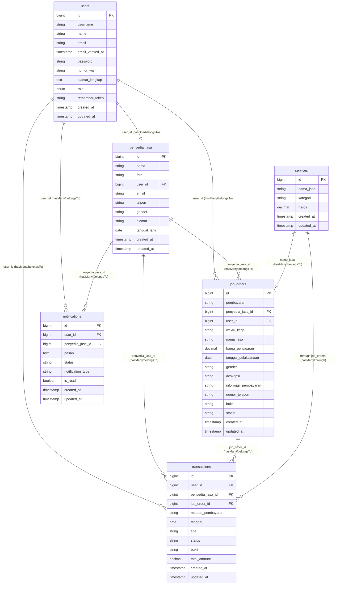

# ERD Model Laravel HandyGo - Status Final

## Diagram Entity Relationship - Model Laravel (Dioptimasi)



---

## Keterangan Relasi Model Laravel

### 🔗 **User Model Relationships**
```php
// app/Models/User.php
public function penyediajasa() // HasOne
public function transactions() // HasMany (sebagai customer)
public function notifications() // HasMany (sebagai penerima)
public function jobOrders() // HasMany (sebagai customer)
```

### 🔗 **PenyediaJasa Model Relationships**
```php
// app/Models/PenyediaJasa.php
public function user() // BelongsTo
public function jobOrders() // HasMany (pekerjaan yang dikerjakan)
public function transactions() // HasMany (transaksi yang dilakukan)
public function notifications() // HasMany (notifikasi yang diterima)
```

### 🔗 **Service Model Relationships**
```php
// app/Models/Service.php
public function jobOrders() // HasMany (melalui nama_jasa)
public function transactions() // HasManyThrough JobOrder
```

### 🔗 **JobOrder Model Relationships**
```php
// app/Models/JobOrder.php
public function user() // BelongsTo (customer)
public function penyediajasa() // BelongsTo (pekerja)
public function service() // BelongsTo (dengan withDefault, opsional)
public function transactions() // HasMany
```

### 🔗 **Transaction Model Relationships**
```php
// app/Models/Transaction.php
public function user() // BelongsTo (customer)
public function penyediaJasa() // BelongsTo (penyedia jasa)
public function jobOrder() // BelongsTo (job order terkait)
```

### 🔗 **Notification Model Relationships**
```php
// app/Models/Notification.php
public function user() // BelongsTo (penerima)
public function penyediaJasa() // BelongsTo (penyedia jasa terkait)

// Scope Methods
public function scopeUnread($query)
public function scopeOfType($query, $type)
public function scopeByStatus($query, $status)

// Helper Methods
public function markAsRead()
public function markAsUnread()
```

---

## 📋 **Field Casting yang Diimplementasi**

### PenyediaJasa
```php
protected $casts = [
    'tanggal_lahir' => 'date',
];
```

### Service
```php
protected $casts = [
    'harga' => 'decimal:2',
];
```

### JobOrder
```php
protected $casts = [
    'tanggal_pelaksanaan' => 'date',
    'harga_penawaran' => 'decimal:2',
];
```

### Transaction
```php
protected $casts = [
    'tanggal' => 'date',
    'total_amount' => 'decimal:2',
];
```

### Notification
```php
protected $casts = [
    'is_read' => 'boolean',
];
```

---

## ⚠️ **Catatan Penting Relasi**

### 1. **Service-JobOrder Relationship**
- **Tidak menggunakan service_id** karena field ini tidak ada di tabel job_orders
- **Menggunakan nama_jasa** sebagai penghubung antar tabel
- Relasi: `Service::hasMany(JobOrder, 'nama_jasa', 'nama_jasa')`

### 2. **PenyediaJasa-User Relationship**
- **One-to-One relationship** where User can have max 1 PenyediaJasa profile
- **user_id** di tabel penyedia_jasa adalah foreign key ke users.id

### 3. **Transaction Relationships**
- **Terhubung ke 3 entity**: User (customer), PenyediaJasa (provider), JobOrder (job)
- **job_order_id** dan **total_amount** adalah field baru yang ditambahkan

### 4. **Notification Features**
- **is_read** boolean field untuk tracking status baca
- **notification_type** untuk kategorisasi notifikasi
- **Dual relationship** ke User dan PenyediaJasa

---

## ✅ **Status Verifikasi**

- ✅ **Semua relasi telah diuji dan berfungsi dengan baik**
- ✅ **Foreign key constraints valid dan konsisten**
- ✅ **Casting field sudah sesuai tipe data**
- ✅ **Fillable fields lengkap dan akurat**
- ✅ **Helper methods dan scope beroperasi optimal**

**Model Laravel HandyGo telah siap untuk production! 🚀**
