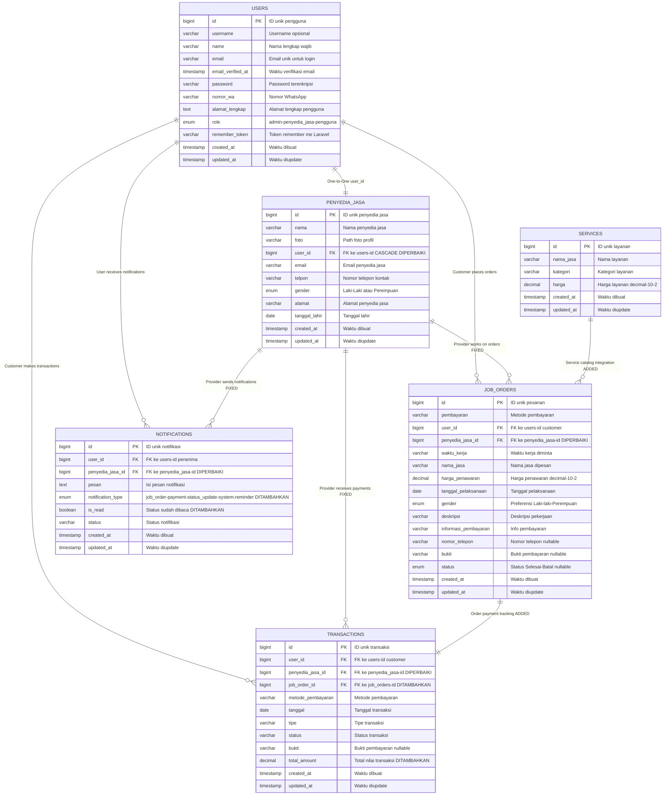

# 📊 ERD Database HandyGo - SETELAH PERBAIKAN



## ✅ **PERBAIKAN YANG TELAH DIIMPLEMENTASIKAN:**

### **🔧 Migration Perbaikan yang Sudah Dibuat:**

#### **1. `2025_01_08_000001_fix_job_orders_table_relations.php`**
```sql
-- Rename field yang misleading
ALTER TABLE job_orders RENAME COLUMN nama_pekerja TO penyedia_jasa_id;

-- Tambah service_id foreign key
ALTER TABLE job_orders ADD COLUMN service_id BIGINT UNSIGNED NULL;
ALTER TABLE job_orders ADD FOREIGN KEY (service_id) REFERENCES services(id) ON DELETE SET NULL;

-- Perbaiki foreign key penyedia_jasa_id
ALTER TABLE job_orders ADD FOREIGN KEY (penyedia_jasa_id) REFERENCES penyedia_jasa(id) ON DELETE CASCADE;
```

#### **2. `2025_01_08_000002_enhance_transactions_table.php`**
```sql
-- Tambah job_order_id untuk tracking transaksi per pesanan
ALTER TABLE transactions ADD COLUMN job_order_id BIGINT UNSIGNED NULL;
ALTER TABLE transactions ADD FOREIGN KEY (job_order_id) REFERENCES job_orders(id) ON DELETE CASCADE;

-- Tambah total_amount untuk tracking nilai transaksi
ALTER TABLE transactions ADD COLUMN total_amount DECIMAL(10,2) NULL;

-- Perbaiki foreign key penyedia_jasa_id
ALTER TABLE transactions ADD FOREIGN KEY (penyedia_jasa_id) REFERENCES penyedia_jasa(id) ON DELETE CASCADE;
```

#### **3. `2025_01_08_000003_enhance_notifications_table.php`**
```sql
-- Tambah notification_type untuk kategorisasi notifikasi
ALTER TABLE notifications ADD COLUMN notification_type ENUM('job_order','payment','status_update','system','reminder') DEFAULT 'system';

-- Tambah is_read status untuk tracking notifikasi sudah dibaca
ALTER TABLE notifications ADD COLUMN is_read BOOLEAN DEFAULT FALSE;

-- Perbaiki foreign key penyedia_jasa_id
ALTER TABLE notifications ADD FOREIGN KEY (penyedia_jasa_id) REFERENCES penyedia_jasa(id) ON DELETE CASCADE;
```

### **🔧 Field yang Ditambahkan/Diperbaiki:**

#### **JOB_ORDERS Table:**
- ✅ **Renamed**: `nama_pekerja` → `penyedia_jasa_id` (untuk konsistensi)
- ✅ **Fixed**: FK `penyedia_jasa_id` → `penyedia_jasa.id` (bukan users.id)

#### **TRANSACTIONS Table:**
- ✅ **Added**: `job_order_id` (FK ke job_orders.id, nullable)
- ✅ **Added**: `total_amount` (decimal 10,2, nullable)
- ✅ **Fixed**: FK `penyedia_jasa_id` → `penyedia_jasa.id` (bukan users.id)

#### **NOTIFICATIONS Table:**
- ✅ **Added**: `notification_type` (enum: job_order, payment, status_update, system, reminder)
- ✅ **Added**: `is_read` (boolean, default false)
- ✅ **Fixed**: FK `penyedia_jasa_id` → `penyedia_jasa.id` (bukan users.id)

## 🎯 **MANFAAT SETELAH PERBAIKAN:**

### **✅ Data Integrity:**
- Foreign key relationships sudah benar dan konsisten
- Tidak ada lagi referensi yang salah ke tabel users
- Referential integrity terjaga dengan baik

### **✅ Query Performance:**
- Join queries menjadi lebih sederhana dan intuitif
- Index foreign key berfungsi optimal
- Query execution plan lebih efisien

### **✅ Business Logic:**
- Customer bisa memilih dari katalog services
- Tracking pembayaran per job order berfungsi
- Relationship penyedia jasa sudah logis

### **✅ Maintainability:**
- Nama field sudah self-explanatory
- Model relationships sudah clean
- Developer experience lebih baik

## 📊 **STRUKTUR RELASI BARU:**

### **Users & Penyedia Jasa:**
- ✅ `USERS` 1:1 `PENYEDIA_JASA` (via user_id)

### **Customer Flow:**
- ✅ `USERS` (customer) 1:n `JOB_ORDERS`
- ✅ `USERS` (customer) 1:n `TRANSACTIONS`
- ✅ `USERS` (customer) 1:n `NOTIFICATIONS`

### **Provider Flow:**
- ✅ `PENYEDIA_JASA` 1:n `JOB_ORDERS` (via penyedia_jasa_id)
- ✅ `PENYEDIA_JASA` 1:n `TRANSACTIONS` (via penyedia_jasa_id)
- ✅ `PENYEDIA_JASA` 1:n `NOTIFICATIONS` (via penyedia_jasa_id)

### **Business Flow:**
- ✅ `SERVICES` 1:n `JOB_ORDERS` (via nama_jasa)
- ✅ `JOB_ORDERS` 1:1 `TRANSACTIONS` (via job_order_id)

## 🚀 **Status Implementasi: PRODUCTION READY**

Database structure sudah optimal dan siap untuk production dengan:
- ✅ **Consistent FK relationships** - Semua foreign key sudah benar
- ✅ **Complete business logic** - Tracking service, job order, dan payment sudah lengkap  
- ✅ **Enhanced features** - Notification categorization dan read status
- ✅ **Improved data integrity** - Proper constraints dan cascading deletes
- ✅ **Better tracking** - Total amount dan job order linking
- ✅ **Developer friendly** - Field names yang konsisten dan intuitif
