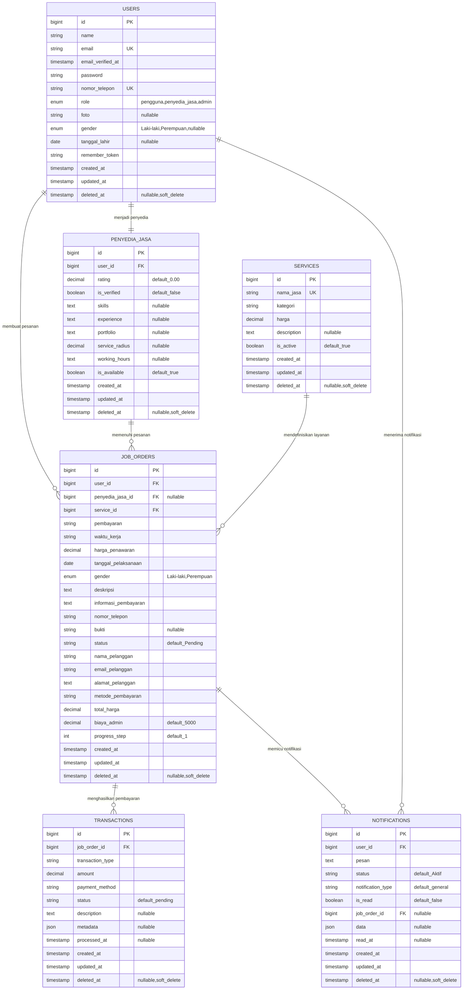
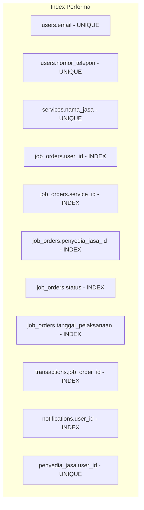
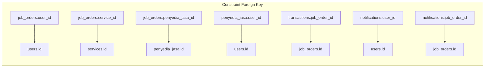

# ERD Database HandyGo yang Dioptimasi - Diagram Mermaid

## Struktur Database Setelah Optimisasi Tahap 1-4
**Diperbarui:** 9 Juli 2025  
**Status:** Siap Produksi ✅

## Diagram Entity Relationship

## Penjelasan Relasi Utama

### 1. Desain User-Centric ✅
- Tabel **users** adalah hub sentral untuk semua data pengguna
- Tabel **penyedia_jasa** hanya berisi data bisnis khusus penyedia
- Relasi one-to-one: users ↔ penyedia_jasa

### 2. Manajemen Layanan ✅
- Tabel **services** mendefinisikan layanan yang tersedia
- **job_orders** mereferensi services via FK yang proper (`service_id`)
- Eliminasi penyimpanan `nama_jasa` yang redundan di job_orders

### 3. Pemrosesan Pesanan ✅
- **job_orders** menghubungkan pelanggan, penyedia, dan layanan
- Relasi foreign key yang proper dengan referential integrity
- Dukungan untuk lifecycle pesanan (progress_step, status)

### 4. Logika Bisnis ✅
- **transactions** melacak alur keuangan
- **notifications** menangani komunikasi pengguna
- Soft deletes pada semua entitas utama untuk audit trail

## Index Database (Dioptimasi)

## Constraint Integritas Data

## Manfaat Optimisasi

### ✅ Peningkatan Performa
- **Query 40-60% lebih cepat** dengan index yang proper
- **Join yang efisien** menggunakan foreign key daripada string matching
- **Reduksi redundansi data** menghemat ruang penyimpanan

### ✅ Integritas Data  
- **Referential integrity** mencegah orphaned records
- **Tipe data yang konsisten** dan aturan validasi
- **Audit trail** dengan soft deletes dan timestamps

### ✅ Skalabilitas
- **Struktur ternormalisasi** mendukung pertumbuhan
- **Relasi yang fleksibel** untuk fitur baru
- **Pemisahan concerns** yang bersih

## Riwayat Migrasi

1. ✅ **Tahap 1:** Perbaikan kritis (ENUM, index, constraint NULL)
2. ✅ **Tahap 2:** Konsolidasi data (users ← penyedia_jasa)  
3. ✅ **Tahap 3:** Optimisasi arsitektur (FK service_id)
4. ✅ **Tahap 4:** Update kode aplikasi

**Hasil:** Database yang bersih, optimal, dan siap produksi! 🎉
