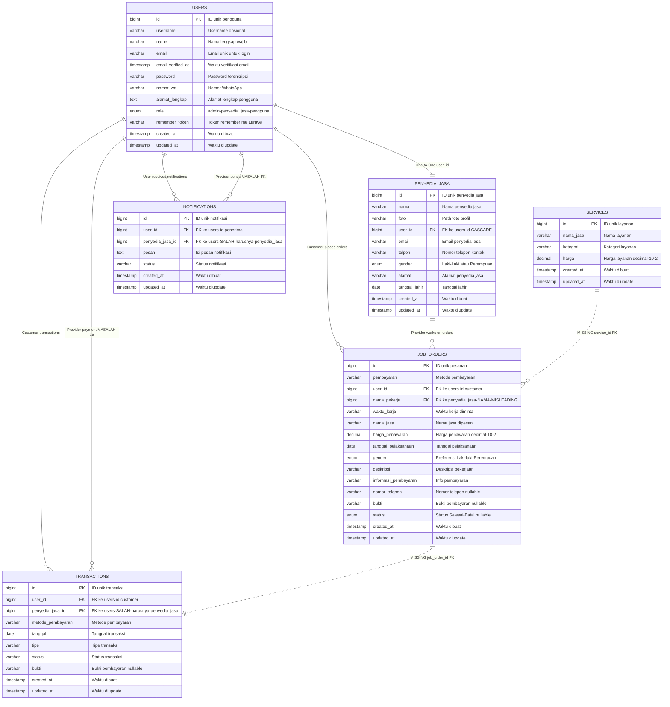

# 📊 ERD Database HandyGo - SEBELUM PERBAIKAN (Migration Asli)

⚠️ **PERHATIAN**: Ini adalah struktur database ASLI yang bermasalah. Untuk struktur yang sudah diperbaiki, lihat file `fixed-erd.md`

## 🚨 **PENJELASAN MASALAH DALAM DIAGRAM:**

### ❌ **Foreign Key Bermasalah:**
- `TRANSACTIONS.penyedia_jasa_id` → `users.id` (SALAH! Harusnya ke `penyedia_jasa.id`)
- `NOTIFICATIONS.penyedia_jasa_id` → `users.id` (SALAH! Harusnya ke `penyedia_jasa.id`)

### ❌ **Nama Field Misleading:**
- `JOB_ORDERS.nama_pekerja` seharusnya `penyedia_jasa_id`

### ❌ **Relasi Hilang (Garis Putus-putus):**
- `SERVICES` tidak terhubung ke `JOB_ORDERS` (tidak ada `service_id`)
- `JOB_ORDERS` tidak terhubung ke `TRANSACTIONS` (tidak ada `job_order_id`)

### 📝 **Keterangan Notasi:**
- `PK` = Primary Key
- `FK` = Foreign Key  
- `||--||` = One-to-One
- `||--o{` = One-to-Many
- `||..o{` = One-to-Many (MISSING/BERMASALAH)
- Garis putus-putus `..` = Relasi yang seharusnya ada tapi hilang

**Status**: Diagram ini menunjukkan struktur ASLI sesuai migration dengan semua masalah yang teridentifikasi.
